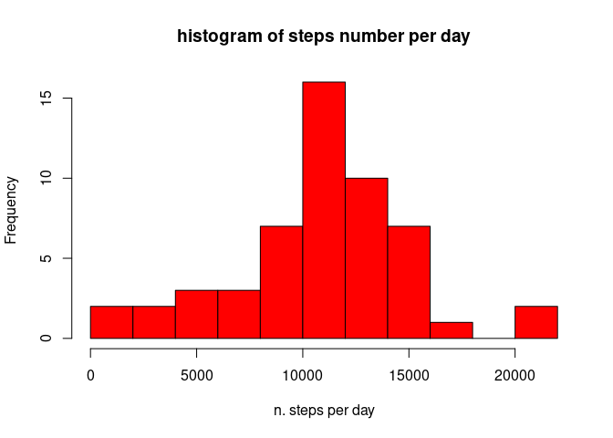
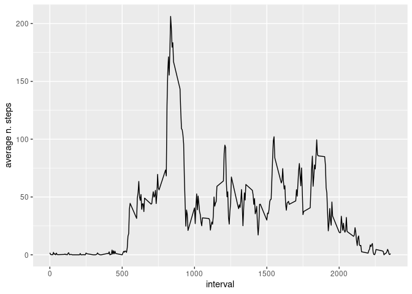
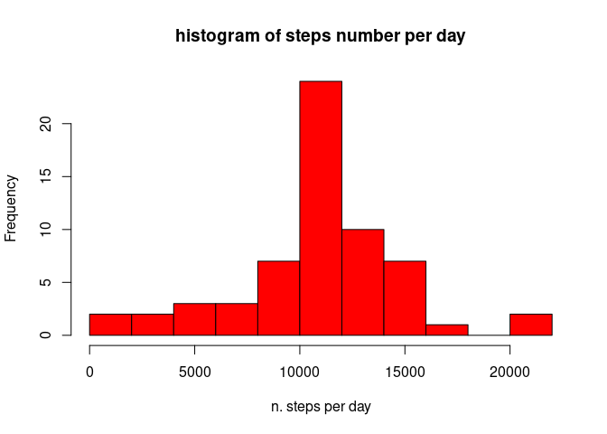

## Loading and preprocessing the data

Start by setting current working directory; then check the dataset zip file is available. If not download it from the website

```r
setwd("/home/jacopo/Documents/courses/DATA SCIENCE/REPRODUCIBILITY/RepData_PeerAssessment1")
if (!file.exists("repdata_data_activity.zip")) {
  download.file("https://d396qusza40orc.cloudfront.net/repdata%2Fdata%2Factivity.zip")
  unzip("repdata_data_activity.zip")
}
```
Check now that the dataset is available; if not unzip the previous file

```r
if (!file.exists("activity.csv")) {
  unzip("repdata_data_activity.zip")
}
```
Load the dataset and show the first 6 rows

```r
df <- read.csv("activity.csv", sep=',')
head(df)
```

```
##   steps       date interval
## 1    NA 2012-10-01        0
## 2    NA 2012-10-01        5
## 3    NA 2012-10-01       10
## 4    NA 2012-10-01       15
## 5    NA 2012-10-01       20
## 6    NA 2012-10-01       25
```

## What is mean total number of steps taken per day?

Here I need to ignore the NA in the dataset


```r
df_no_na <- df[complete.cases(df),]
head(df_no_na)
```

```
##     steps       date interval
## 289     0 2012-10-02        0
## 290     0 2012-10-02        5
## 291     0 2012-10-02       10
## 292     0 2012-10-02       15
## 293     0 2012-10-02       20
## 294     0 2012-10-02       25
```

1) Compute the total number of steps taken per day


```r
library('plyr')
cumdf <- ddply(df_no_na, "date", numcolwise(sum))
head(cumdf)
```

```
##         date steps interval
## 1 2012-10-02   126   339120
## 2 2012-10-03 11352   339120
## 3 2012-10-04 12116   339120
## 4 2012-10-05 13294   339120
## 5 2012-10-06 15420   339120
## 6 2012-10-07 11015   339120
```

2) Plot a histogram of the total number of steps per day


```r
hist(cumdf$steps, breaks=10, xlab="n. steps per day", main="histogram of steps number per day", col="red")
```

<!-- -->

3) Compute the mean of the total number of steps taken each day


```r
mean(cumdf$steps)
```

```
## [1] 10766.19
```

4) Compute the median of the distribution


```r
median(cumdf$steps)
```

```
## [1] 10765
```

## What is the average daily activity pattern?

1) Make a time series plot of the time interval (x-axis) and the averaged number of steps taken across all days


```r
df_plot <- aggregate(steps~interval, df_no_na, FUN=mean)
library('ggplot2')
p <- ggplot(df_plot, aes(x=interval, y=steps)) + geom_line() + ylab("average n. steps")
p
```

<!-- -->

2) Which 5 minutes interval, on average across all the days in the dataset, contains the maximum number of steps ?


```r
max_int <- df_plot[df_plot$steps == max(df_plot$steps),]$interval
max_int
```

```
## [1] 835
```

## Imputing missing values

1) Total number of missing values in the dataset


```r
colSums(is.na(df))
```

```
##    steps     date interval 
##     2304        0        0
```

2304 missing data in steps column

2) Devise a strategy for filling in all the missing values in the dataset. Then create a new data set by replacing the NAs with the new values.
I use the mean of the number of steps for every interval to replace the NAs


```r
intervals <- levels(factor(df$interval))
df_clean <- df
for (i in intervals) {
  newdata <- subset(df_clean, interval==i)
  r <- mean(newdata$steps, na.rm = TRUE)
  df_clean$steps[with(df_clean, is.na(steps) & interval==i)] <- r
}
```

3) Compute total number of steps taken each day


```r
cum_dfclean <- ddply(df_clean, "date", numcolwise(sum))
```

4) Make a histogram of the total number of steps taken each day


```r
hist(cum_dfclean$steps, breaks=10, xlab="n. steps per day", main="histogram of steps number per day", col="red")
```

<!-- -->

5) Calculate and report the mean of steps taken each day


```r
mean(cum_dfclean$steps)
```

```
## [1] 10766.19
```

6) Compute the median


```r
median(cum_dfclean$steps)
```

```
## [1] 10766.19
```

As expected the mean of the total number of steps does not change with respect to the value obtained from the original dataset. The median instead changes slightly, but our filling procedure did not significantly alter the average properties of the dataset.

## Are there differences in activity patterns between weekdays and weekends?

1) Create a new factor variable in the dataset with two levels - "weekday" and "weekend" indicating whether a given date is a weekday or a weekend


```r
library('chron')
is_weekend <- function(x) {
  if (chron::is.weekend(x)) return("weekend")
  else return("weekday")
}
df_clean$day_week <- lapply(df_clean$date, function(x) sapply(x, is_weekend))
head(df_clean)
```

```
##       steps       date interval day_week
## 1 1.7169811 2012-10-01        0  weekday
## 2 0.3396226 2012-10-01        5  weekday
## 3 0.1320755 2012-10-01       10  weekday
## 4 0.1509434 2012-10-01       15  weekday
## 5 0.0754717 2012-10-01       20  weekday
## 6 2.0943396 2012-10-01       25  weekday
```

2) Make a panel plot containing a time series plot (i.e. type="l") of the 5-minute interval (x-axis) and the average number of steps taken, averaged across all weekday days or weekend days (y-axis).


```r
df_wday <- df_clean[df_clean$day_week=="weekday",]
wday_plt <- aggregate(interval ~ steps, df_wday, FUN=mean)
p1 <- ggplot(wday_plt, aes(x=interval, y=steps)) + geom_line() + ggtitle("week day")
df_wend <- df_clean[df_clean$day_week=="weekend",]
wend_plt <- aggregate(interval ~ steps, df_wend, FUN=mean)
p2 <- ggplot(wend_plt, aes(x=interval, y=steps)) + geom_line() + ggtitle("week end")
```

Plotting the figures

```r
p1
```

<!-- -->

```r
p2
```

<!-- -->
